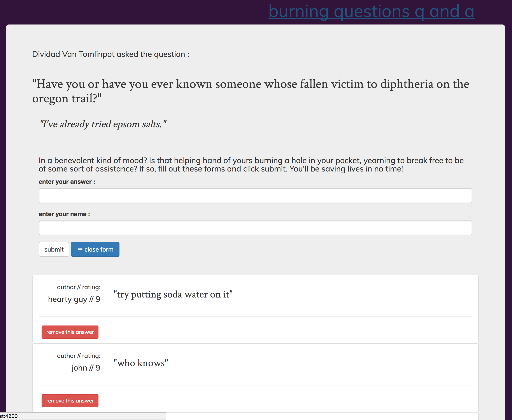

# functional-forum-ember
#### A website that provides users the functionality of being able to post questions to a forum as well as rate, save favorites, and delete community posted responses.
---
---

---
## Prerequisites
---

You will need the following things properly installed on your computer.

* [Git](http://git-scm.com/)
* [Node.js](http://nodejs.org/) (with NPM)
* [Bower](http://bower.io/)
* [Ember CLI](http://ember-cli.com/)
* [PhantomJS](http://phantomjs.org/)

## Installation
---

* `git clone <repository-url>` this repository
* `cd functional-forum-ember`
* `npm install`
* `bower install`

## Running / Development
---

* `ember serve`
* Visit [http://localhost:4200](http://localhost:4200) in your web browser.

### Code Generators
---

Make use of the many generators for code, try `ember help generate` for more details

### Running Tests
---

* `ember test`
* `ember test --server`

### Building
---

* `ember build` (development)
* `ember build --environment production` (production)

### ~~Known Bugs~~
---

### Further Reading / Useful Links
---

* [ember.js](http://emberjs.com/)
* [ember-cli](http://ember-cli.com/)
* Development Browser Extensions
  * [ember inspector for chrome](https://chrome.google.com/webstore/detail/ember-inspector/bmdblncegkenkacieihfhpjfppoconhi)
  * [ember inspector for firefox](https://addons.mozilla.org/en-US/firefox/addon/ember-inspector/)
---
---
##### by Kyle Fisher 2016
